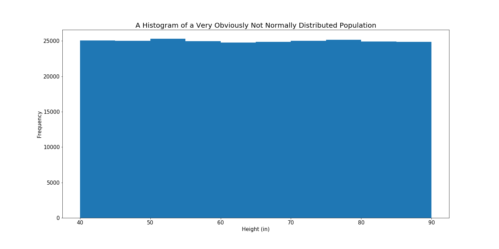

by Tim Christy

<br>

Imagine that you want to know the mean height of everybody in Reno, NV. Since it is impractical to go out and measure the height of all 250,000+ people, you would have to rely on sample data (*randomly* sampled) to estimate this parameter. The **central limit theorem** says that every single possible mean we could get from our samples follows a normal distribution with a mean that will be very close to the population mean so long as our sample size is large enough.

<br>

To illustrate, suppose I go out and randomly measure 30 people and take the mean of their heights. Then I go out and do it again for another 30 people. And another. And so on like this until I get every single possible combination of 30 people in the entire city and the mean heights of each of these combinations. The distribution of all of these mean heights form the sampling distribution of the sample mean for a sample size of 30. It is the distribution of every possible mean you could get from a sample of 30 people in this city.

It doesn't have to be 30 people either. There is a unique sampling distribution for every value of the sample size chosen. The distribution for samples of 15 people would look different from the sampling distribution of 30 people or 4 people or 16 people, etc. The difference would be due to the standard error; which is the standard deviation of the sampling distribution. The larger the sample size, the smaller the standard error.

<br>

Also, these samples typically need to be done with replacement unless the samples taken are less than about 10% of the population.

<br>

Ok, let's look at an example.

<br>

# Generating random height data (inches) for 250,000 people  

```Python  
import numpy as np  
import matplotlib.pyplot as plt  
%matplotlib inline  

np.random.seed(10)  
random_data = [np.random.randint(40,90) for x in range(250000)]
```

<br>

Plotting the distribution of this population...   

<br>

```python
plt.figure(figsize=(20,10))
plt.title('A Histogram of a Very Obviously Not Normally Distributed Population', fontsize=20)
plt.xlabel('Height (in)', fontsize=15)
plt.ylabel('Frequency', fontsize=15)
plt.xticks(fontsize=15)
plt.yticks(fontsize=15)
plt.hist(random_data, bins = [40, 45, 50, 55, 60, 65, 70, 75, 80, 85, 90]);
plt.show()
```

  

Above we generated data about the heights of 250,000 people. The data we generated gave us a population that is uniformly distributed; meaning that every height is equally likely (how different would that world look?). What is the mean height of this population?   

```python
round(np.mean(random_data),1)
```   
64.5   

<br>

Again, the central limit theorem says that despite the shape of the population distribution, the sampling distribution will be normally distributed with a mean equal to the population mean, as long as the sample size n, is large enough (typically 30 or more). Let's build some sampling distributions and check it out.   

```python  
# randomly pick 5 people from the above population, take their average, and repeat 10 times
# randomly pick 5 people from the above population, take their average, and repeat 10 times
n5 = [np.mean(np.random.choice(random_data, 5)) for x in range(100)]

# randomly pick 15 people from the above population, take their average, and repeat 10 times
n15 = [np.mean(np.random.choice(random_data, 15)) for x in range(100)]

# randomly pick 30 people, and do the same...
n30 = [np.mean(np.random.choice(random_data, 30)) for x in range(100)]

# randomly pick 100 people " " " " " "
n100 = [np.mean(np.random.choice(random_data, 100)) for x in range(100)]

```   

And now plot these sampling distributions   

```python
plt.figure(figsize=(20,10))
plt.subplots_adjust(hspace=.5)
plots = [n5, n15, n30, n100]
labels = ['n=5', 'n=15', 'n=30', 'n=100']
counter = 0
for plot in plots:
    counter+=1
    plt.subplot(2,2,counter)
    plt.title(f'Sampling Distribution for {labels[counter-1]}', fontsize=20)
    plt.xlabel('Height (in)', fontsize=20)
    plt.ylabel('Frequency', fontsize=20)
    plt.xticks(fontsize=20)
    plt.yticks(fontsize=20)
    plt.xlim([40, 90])
    plt.hist(plot);
```   

   

# Observations

- Notice that as n gets larger, the mean of the sampling distribution tightens around the population mean of 64.5
- This is one reason why a large sample size is important in this estimation. If the sample size is too small as it is with n = 5, you risk any given sample landing between a mean of 45 and 80. Sometimes the normality of the sampling distribution is void too, with a small sample size.  

That is essentially what the central limit theorem is: even if the population distribution is not normally distributed itself, the distribution of sample means will be and the mean of the distribution of sample means will be equal to the population mean.

Let's try another distribution and make it really skewed.   

```python

dist1 = list(np.random.laplace(loc=50, size=1000))
dist2 = list(np.random.exponential(size=1000) + 55)
dist3 = [np.random.randint(60, 100) for x in range(1000)]

exp = dist1+dist2+dist3
```   

  

Building and plotting sampling distributions again,  

```python  
n5 = [np.mean(np.random.choice(exp, 5)) for x in range(100)]
n15 = [np.mean(np.random.choice(exp, 15)) for x in range(100)]
n30 = [np.mean(np.random.choice(exp, 30)) for x in range(100)]
n100 = [np.mean(np.random.choice(exp, 100)) for x in range(100)]
```

```python  
plt.figure(figsize=(20,10))
plt.subplots_adjust(hspace=.5)
plots = [n5, n15, n30, n100]
labels = ['n=5', 'n=15', 'n=30', 'n=100']
counter = 0
for plot in plots:
    counter+=1
    plt.subplot(2,2,counter)
    plt.title(f'Sampling Distribution for {labels[counter-1]}', fontsize=20)
    plt.xlabel('Random Data', fontsize=20)
    plt.ylabel('Frequency', fontsize=20)
    plt.xticks(fontsize=20)
    plt.yticks(fontsize=20)
    plt.xlim([50,100])
    plt.hist(plot);  
```   

  

Still, the sampling distributions look normal. The higher the n the better the approximation to the normal distribution.


# Main Takeaways

This whole process works for other parameters too. For example, the proportion of the population that supports candidate A or likes pizza or whatever. The population distribution does not matter so much, if the sample size is large. With a large sample size, you can still make a reasonable estimate.

One reason why this is so important is that it allows for hypothesis testing and confidence intervals, which rely on the assumption of a normal distribution. The central limit theorem helps to make that assumption valid.  
