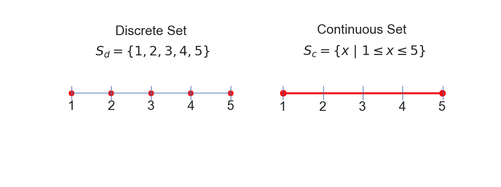
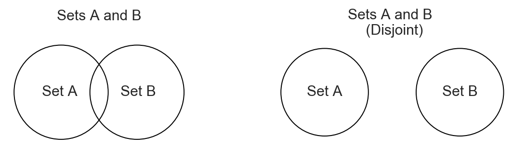
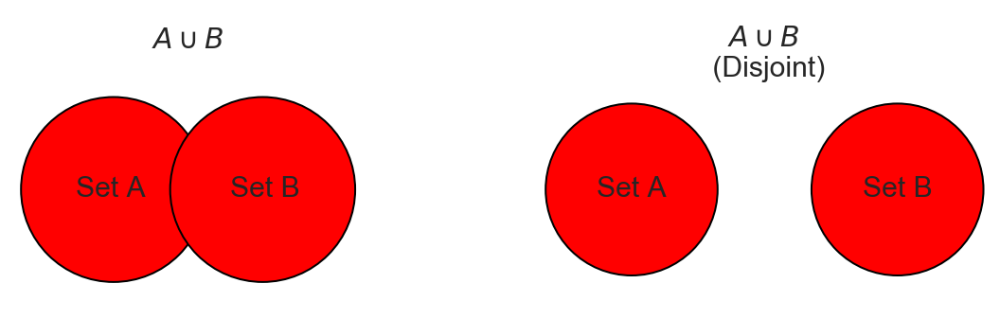
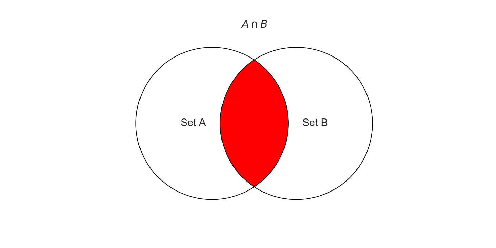
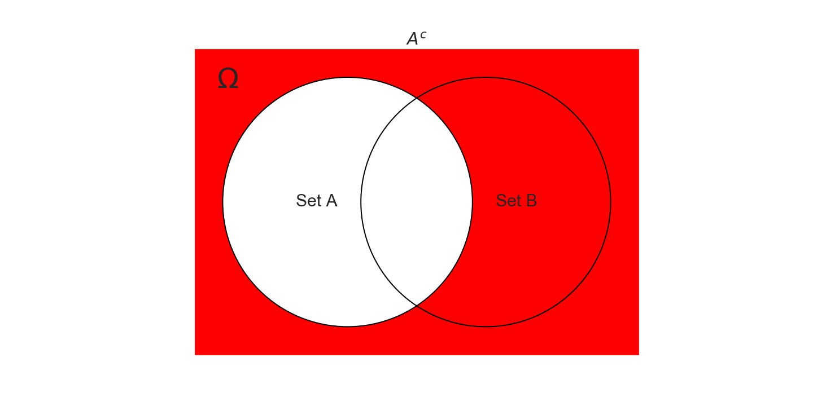
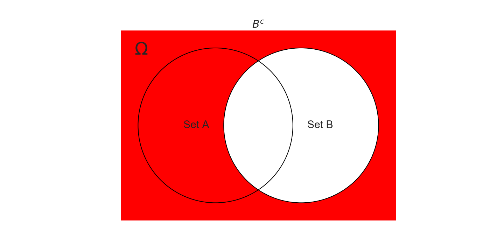
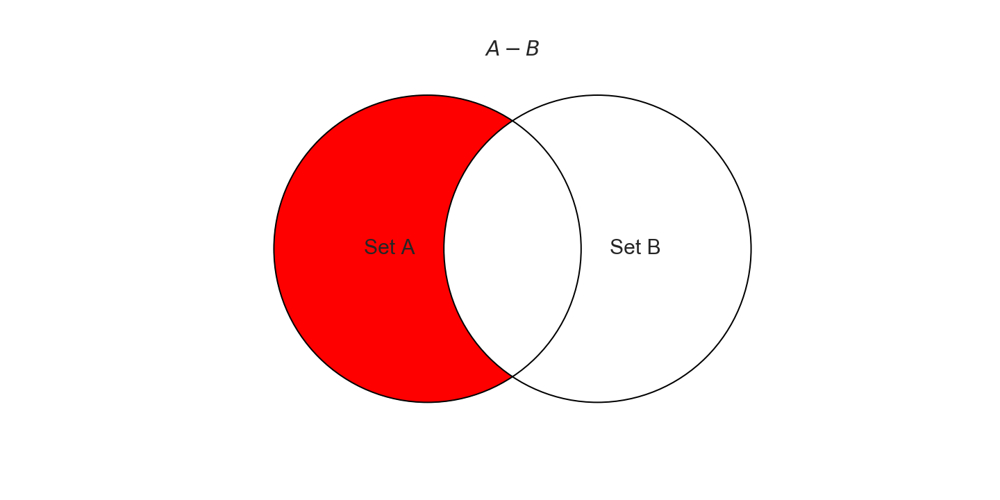
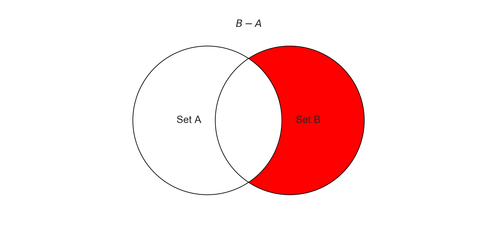
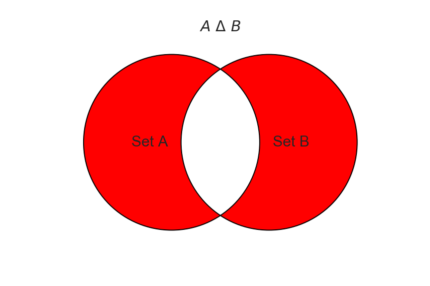

## Navigation
1. [Introduction](sets#introduction)
2. [Sets](sets#sets)  
3. [Cardinality](sets#cardinality)
4. [Sets and Probability](sets#sets-and-probability)
5. [Set Operations](sets#set-operations)   
6. [Set Notation](sets#set-notation)
7. [References](sets#references)  
8. [Other Resources](sets#other-resources)

   

# Introduction
This page discusses a some set theory at an introductory level. 

  
## Sets
<b>Sets</b> are a unique collection of items. These items can be anything: numbers, apples, oranges, types of toothpaste, cars, galaxies, whatever. The individual items that compose a set are called  elements . Sets are denoted with curly braces and the elements are listed inside separated by a comma. Below are some examples:

$$
\begin{aligned}
  S_1 &= \{1, 2, 3, 4\} \\[0.5em]
  S_2 &= \{\text{rain, cats, dogs}\}\\[0.5em]
  S_3 &= \{\text{green, red, blue, orange, purple}\}
\end{aligned}
$$

In set notation when an element $$x$$ belongs to a set $$A$$ it is denoted   

$$x \in A$$   

If an element does not belong to a set $$A$$ it is denoted   

$$ x \not \in A$$  

The order and repetition does not matter when it comes to a set.
That is to say

$$\{\text{a, a, a, b, c}\} = \{\text{a, b, c}\} = \{\text{c, b, a}\} = \{\text{b, c, a}\}$$

The equation immediately above shows that all 4 sets are all equal. Repetition does not matter. Order does not matter. All that matters is that you have the unique elements that belong to the set.

Although sets can contain anything, when talking about discrete and continuous sets, it is helpful to think of set elements as numbers.   

A discrete set contains discrete elements. These elements are easy to understand because they are well-defined points. This is perhaps best illustrated by comparing them to the elements of a continuous set. Take the set of whole numbers 1 through 5. This discrete set is $$S_d = \{1, 2, 3, 4, 5\}$$. That is 5 elements in total. However, the continuous set over this range, $$S_c = \{x\  | \ 1 \leq x \leq 5\}$$, would have an infinite number of elements between 1 and 5. This is because this continuous set can take on ANY value between 1 and 5, including decimals (i.e., 1.000000001..., 1.0000000100001..., 2.324174893261..., 4.9999999999...) There are an infinite selection. So the elements of $$S_d$$ are discrete, while the elements of $$S_c$$ are continuous. The graph below shows a representation of these sets on the number line.  
  

In starting examples above, $$S_1$$, $$S_2$$, and $$S_3$$ were discrete sets.  
The mathematical notation for the continuous set $$S_c = \{x\ | \ 1 \leq x \leq 5\}$$ can be read aloud as "$$S_c$$ equals the set of all x, such that x is any value greater than or equal to 1 and less than or equal to 5." The | marker in the notation can be read as "such that". Sometimes it is written as a colon (:) instead, but it means the same thing (i.e., $$\{x\ | \ 1 \leq x \leq 5\} = \{x\ : \ 1 \leq x \leq 5\}$$).

Another example of a continuous set is the set of real numbers, denoted  

$$\mathbb{R} = \{x\ |\ -\infty < x < \infty\}$$  

and read in the same manner as before (i.e., "the set of all x such that x is any value in between negative infinity and positive infinity"). It is the set of all the values on the number line. There is more about set notation in the last section of this blog.  

### Subsets, Disjoint Sets, Null Set, and Universal Set
Set $$A$$ is a $$\textbf{subset}$$ of set $$B$$ if $$A$$ only contains elements that are found in $$B$$. $$A$$ does not have to have all of the elements of $$B$$, it may only contain a few, but all of its elements are in $$B$$ nonetheless. In mathematical notation, to indicate that $$A$$ is a subset of $$B$$ we write  

$$A \subseteq B$$

Note that it is similar to a less than or equal to sign with the curved edge always pointing toward the subset.   

A subset can contain all the elements of its parent set. That is, set $$A$$ can be equal to set $$B$$ and still $$A$$ is a subset of $$B$$. Conversely $$B$$ is also a subset of $$A$$. This means that every set is a subset of itself. The above notation includes this definition.  

This is to be contrasted with a $$\textbf{proper subset}$$ which is a subset of a parent set that contains fewer elements than the parent set. If $$A$$ is a proper subset of $$B$$ then we write  

$$A \subset B$$  

Again, this notation means that $$A$$ contains only elements of $$B$$ but not all of the elements of $$B$$. Anytime that $$A$$ is a proper subset of $$B$$ it is also a subset of $$B$$. A parallel can be drawn with less than or equal to signs. If number $$a$$ is less than number $$b$$ then number $$a$$ is also less than or equal to number $$b$$. Similarly if set $$A$$ is a proper subset of set $$B$$, then set $$A$$ is also a subset of set $$B$$.  

$$$$

$$\textbf{Examples}$$
1. To illustrate that last point, if $$A$$ = {12, 15} and $$B$$ = {12, 13, 14, 15, 16} then  
 $$A \subset B$$ and $$A \subseteq B$$.   

2. If $$A = \{1, 2, 3\}$$ and $$B = \{1, 2, 3\}$$ then $$A \subseteq B$$ and $$B \subseteq A$$     

3. If $$A = \{\text{Neil Armstrong, Buzz Aldrin, Michael Collins}\}$$ and   
$$B = \{\text{All Astronauts}\}$$ then
$$A \subset B$$ (and $$A \subseteq B$$ but that point has been driven and so from here on will omit that bit of pedanticism).   

4. If $$A = \{\text{USA, Argentina, Liberia, Japan, France}\}$$ and $$B = \{\text{all countries}\}$$ then $$A \subset B$$   

5. If $$A = \{\text{USA, Argentina, Liberia, an apple, Japan, France}$$ and $$B =\{\text{all countries}$$ then $$A$$ is NOT a subset of $$B$$ because of the apple found in set $$A$$ and not in set $$B$$. This is denoted by $$A \not \subset B$$ or $$A \not \subseteq B$$   

$$$$

$$\textbf{Superset}$$  
When $$A$$ is a subset of $$B$$, we can call $$B$$ a superset of $$A$$. This can be written as  

$$B \supseteq A$$  

or, if $$B$$ is a proper superset of $$A$$  

$$B \supset A$$  

where $$\superseteq$$ and $$superset$$ are the superset and proper superset signs respectively.

$$$$

$$\textbf{Disjoint Sets}$$  
Two sets are said to be $$\textbf{disjoint}$$ if they do not share any elements. If set  
$$A = \{\text{a, b, c}\}$$ and set $$B = \{\text{x, y, z}\}$$ then they share no common elements and are disjoint.

$$$$

$$\textbf{Null Set}$$  
The $$\textbf{null set}$$ is a set that has no elements. It is represented with this symbol: $$\emptyset$$

$$\emptyset = \{\}$$

The null set is a subset of every set; including itself.

$$$$

$$\textbf{Universal Set}$$  
The universal set contains all elements of interest and is denoted by $$\Omega$$. The definition of the universal set will vary depending on the elements of interest. Some demonstrations of universal sets can be the set of all astronauts or the set of all countries as shown in the examples above. Another example could be the set of all outcomes for rolling a pair of dice.

$$$$

## Cardinality$$   
Cardinality refers to the number of elements in a set. For example, if the set A is $$\\[1em]$$

$$A = \{1, 2 ,3 ,4 ,5, 6, 7, 8, 9, 10\} \\[1em]$$

The cardinality of A is denoted
$$|A|$$
and here
$$|A| = 10$$.

More examples:  $$\\[1em]$$
$$\text{If }B = \{\mathrm{a}, \mathrm{b}, \mathrm{c}\} \text{ then } |B| = 3 \\[0.5em]$$  
$$\text{If } C = \{\mathrm{Nevada}, \mathrm{New York}, \mathrm{California}, \mathrm{Oregon}, \mathrm{Hawaii}\} \text{ then } |C| = 5$$  

$$$$

## Sets and Probability   
One way to describe the probability of an event happening is to say it is the number of ways that the event can happen divided by the number of ways all things can happen. For example, suppose a family is going to have two new children. What is the probability both babies will be born girls? How about the probability of having a boy and a girl? To observe the probabilities in this manner we can look at the cardinality of the sets that contain the outcomes of interest and the set that contains all possible outcomes (the universal set $$\Omega$$). The universal set is$$\\[.2em]$$  

$$\hspace{5.2cm}\Omega = \{$$ bb, bg, gb, gg$$\} \\[0.1em]$$  
with cardinality |$$\Omega$$| $$= 4$$. Above b represents a boy, g represents a girl, and the order in which they are born is represented by the order in which they appear (i.e., gb means the first child is a girl, the second a boy). If the event we are interested in is that both babies are born girls, we can represent that event with the set $$A$$  

$$A = \{gg\}$$  

If we take the cardinality of $$A$$ divided by the cardinality of $$\Omega$$, we get the probability of the event that both babies will be girls, denoted $$P(A)$$   

$$P(A) = \frac{|A|}{|\Omega|} = \frac{1}{4} = 0.25$$

Ergo, there is a 25% probability of this happening.   

For the probability of having a boy and a girl, the events we are interested in are listed in the set below

$$B = \{bg, gb\}$$  

The universal set is the same as it was before and so the probability of this happening becomes  

$$P(B) = \frac{|B|}{|\Omega|} = \frac{2}{4} = 0.5$$

Sets and cardinality can be a helpful way of thinking in regards to solving some basic probability problems. In particular, this only really works if the probabilities of each outcome are equal. Here we assumed it was so, but often they are not this simple. If the mother had say a genetic mutation that made them 75% more likely to have a boy, these probabilities would be different. More on probability will be discussed in a future post.

$$$$

## Set Operations   

### Union    
A union of two sets is the unique collection of all the elements between the two sets. The union between sets $$A$$ and $$B$$ is represented like so  

$$A \cup B$$  

where $$\cup$$ is the union operator.  
$$\\[2em]$$
$$\textbf{Examples}$$  
$$\textbf{1)}$$ If $$A = \{1, 2, 3, 4, 5, 6\} \text{ and } B = \{4, 5, 6, 7, 8\}$$ then  

$$A \cup B = \{1, 2, 3, 4, 5, 6, 7, 8\}$$

Notice how both sets $$A$$ and $$B$$ contain the numbers 4, 5, and 6 but that their union only has one 4, 5, and 6. This is again because sets only contain unique elements.$$\\[3em]$$

$$\textbf{2)}$$ If $$A = \{\text{orange, green, red, blue}\} \text{ and } B = \{\text{purple, yellow}\}$$ then  

$$A \cup B = \{\text{orange, green, red, blue, purple, yellow}\}$$  

If the sets have no items in common, they are called $$\textbf{disjoint}$$ sets.  
In example 2, $$A$$ and $$B$$ are disjoint sets.  $$\\[3em]$$

$$\textbf{3)}$$ The union operator can also be used over many sets.  
 If $$A = \{\text{1, 2, 3, 4}\} \text{ and } B = \{\text{3, 4, 5, 6, 7, 8}\} \text{ and } C = \{\text{9, 10, 11}\} \text{ and } D = \{\text{11, 12, 13, 14, 15}\}$$ then   

$$A \cup B \cup C \cup D = \{1, 2, 3, 4, 5, 6, 7, 8, 9, 10, 11, 12, 13, 14, 15\}$$  

To generalize  

$$\bigcup\limits_{i=1}^{n}A_i = A_1 \cup A_2 \cup \cdots \cup A_n \\[3em]$$

$$\textbf{Venn Diagrams}$$  
Venn Diagrams are helpful in visualizing set operations. Each circle represents a set and their overlap represents the elements each set has in common. If the circles do not overlap, then the sets are disjoint. This is shown in the figure below  
$$\\[2em]$$

$$\textbf{Venn Diagrams   \ \ \ \ \ \ \ \ \ \ \ \ \ \ \ \ \ \ \ \ \ \ \ \ \ \ \ \ \ \ \ \ \ \ \ \ \ \ \      }$$  

The union of sets $$A$$ and $$B$$ can be represented in a Venn Diagram like so  

where the red shading represents the elements of the set that are included via the union of sets $$A$$ and $$B$$.  

### Intersection    
The intersection of two sets picks out only the elements that are contained in both sets. The intersection of sets $$A$$ and $$B$$ is a set that contains only elements that are common to both $$A$$ and $$B$$. Intersection between sets A and B are represented like so  

$$A \cap B$$

where $$\cap$$ is the intersection operator.$$\\[3em]$$

$$\textbf{1)}$$ If $$A = \{1, 2, 3, 4, 5\} \text{ and } B = \{4, 5, 6, 7, 8\} \text{ then }$$  

$$A\cap B = \{4, 5\}$$  

$$\textbf{2)}$$ If $$A = \{1, 2, 3, 4\} \text{ and } B = \{5, 6, 7, 8\} \text{ then }$$

$$A \cap B = \{\} = \emptyset$$  

where $$\emptyset$$ represents the empty set. The empty set is exactly what it sounds like - a set with no elements in it.  

$$\textbf{3)}$$ The intersection operator can also be used over many sets.  
 If $$A = \{\text{1, 2, 3, 4}\} \text{ and } B = \{\text{4, 6, 8, 9}\} \text{ and } C = \{\text{13, 101, 4, 2 }\} \text{ and } D = \{\text{100, 90, 91, 4}\}$$ then   

$$A \cap B \cap C \cap D = \{4\}$$  

To generalize  

$$\bigcap\limits_{i=1}^{n}A_i = A_1 \cap A_2 \cap \cdots \cap A_n$$

The Venn Diagram representing the intersection of set $$A$$ and $$B$$ is shown below.

  

Note that for disjoint sets the circles do not overlap and there is no intersection. The intersection of two or more disjoint sets is always the empty set $$\emptyset$$.

### Complement    
The complement of a set $$A$$ is every element in the universal set that is not in $$A$$. Suppose set $$A = \{1, 2, 3, 4, 5\}$$ and set $$B = \{4, 5, 6, 7, 8\}$$ and the universal set is the set of all integers, $$\Omega = \mathbb{Z}$$ $$\left(\mathbb{Z} = \bigcup_{-\infty}^{\infty}\{i\} = \{ -\infty , ..., -3, -2, -1, 0, 1, 2, 3, ..., \infty \}\right)$$. Then the complement of $$A$$, denoted $$A^c$$ is the set of all integers without 1, 2, 3, 4, and 5. Likewise, the complement of $$B$$, denoted $$B^c$$ is the set of all integers without 4, 5, 6, 7, and 8.  

Note that the universal set has not been illustrated in a figure until now. Although it has been omitted in the other figures, the universal set is always present.

Also, the complement of the universal set is the null set and the complement of the null set is the universal set.   

### Difference    
The difference between sets $$A$$ and $$B$$ are all the elements in $$A$$ that are not in $$B$$. Or, perhaps better said, it is the set $$A$$ with any and all elements of set $$B$$ taken out of it. The difference between a set $$A$$ and set $$B$$ is represented by  

$$A-B$$

As a simple example, if $$A = \{1, 2, 3, 4, 5\}$$ and $$B = \{4, 5, 6, 7, 8\}$$, then

$$A-B = \{1, 2, 3\}$$

### Symmetric Difference    
The $$\textbf{symmetric difference}$$ between two sets $$A$$ and $$B$$ is the set that contains all the elements of $$A$$ and $$B$$ but NOT BOTH $$A$$ and $$B$$. The symmetric difference between $$A$$ and $$B$$ is denoted  

$$A \Delta B$$

For example, if $$A = \{1, 2, 3, 4, 5\}$$ and $$B = \{4, 5, 6, 7, 8\}$$ (again), then the symmetric difference between $$A$$ and $$B$$ is  

$$A \Delta B = \{1, 2, 3, 6, 7, 8\}$$

Put another way, it is all the elements of $$A$$ and $$B$$ that they do not share in common.

  

### Cartesian Product     
The $$\textbf{\text{Cartesian Product}}$$ between two sets is a set comprised of tuples containing pairs of elements between the two sets. That is to say the first element of the first set paired with all the elements of the second, the second element of the first set paired with all the elements of the second, the third element of the firs set... and so on until the last element of the first set. The Cartesian Product is denoted with a $$\times$$ sign and a tuple, which is a way to group multiple parts as a single element of a set is denoted with parentheses. Examples below.   

$$\textbf{Examples}$$  
$$\textbf{1)}$$ Suppose $$A = \{a, b, c\}$$ and $$B = \{1, 2, 3\}$$. Then the Cartesian Product of $$A$$ and $$B$$ is  

$$A \times B = \{(a,1), (b, 2), (c, 3)\}$$  

The sets can be of different sizes as the next example shows  
$$\textbf{2)}$$ Suppose $$A = \{a, b, c, d, e \}$$ and $$B = \{1, 2\}$$. Then the Cartesian Product of these two sets is  

$$A \times B = \{(a, 1), (a, 2), (b, 1), (b,2), (c,1), (c,2), (d,1), (d, 2), (e, 1), (e,2)\}$$

The Cartesian Product can be performed on many sets at once, adding to the number of elements in each tuple as the next example shows.  
$$\textbf{3)}$$ Let $$A = \{a, b,\}, B = \{1, 2, 3\}, \text{ and } C = \{\alpha\}$$. Then $$A \times B \times C$$ is

$$A \times B \times C = \{(a, 1, \alpha), (a, 2, \alpha), (a, 3, \alpha), (b, 1, \alpha), (b, 2, \alpha), (b, 3, \alpha)\}$$

Generally,

 $$A_1 \times A_2 \times ... \times A_n$$ = \{(a_1, a_2, ..., a_n) | a_1 \in A_1, a_2 \in A_2, ..., a_n \in A_n\}$$  

 where $$\in$$ denotes membership to a set. $$x \in A$$ means that x is an element in set $$A$$. More about this is explained in the next section.

Recall that the set of real numbers is  

$$\mathbb{R} = \{ x | - \infty < x < \infty \} $$  

What then, is the Cartesian Product of $$\mathbb{R} \times \mathbb{R}$$? It is every possible point in a plane and the set is denoted $$\mathbb{R}^2$$. If we think of the first item in the tuple as the x-coordinate and the second item in the tuple as the y-coordinate, every point in a plane is in the set $$\mathbb{R}^2$$. The points (1, 1), (1.000001, 2.20008), (10.23432, 9.4322), (1000000, 2000000), all of them, every single possible point in a plane, is in this set. It is expressed  

$$\mathbb{R}^2 = \{(x, y) | x \in \mathbb{R}, y \in \mathbb{R}\}$$

How about $$\mathbb{R} \times \mathbb{R} \times \mathbb{R} = \mathbb{R}^3$$? Well that is the same thing as $$\mathbb{R}^2 \times \mathbb{R}$$. This gives the set of every possible three-element tuple, which can be used in describing every point in three dimensional space.   

$$\mathbb{R}^3 = \{(x, y, z) | x \in \mathbb{R}, y \in \mathbb{R}, z \in \mathbb{R}\}$$

And so on into higher dimensions...

## Set Notation    
The following contains some basic set-builder notation which can be very helpful in communicating sets. Everything here I learned from a [edX](https://courses.edx.org/courses/course-v1:UCSanDiegoX+DSE210x+3T2019/course/) [1] course called "Probability and Statistics in Data Science using Python" and [the wikipedia article on set-builder notation](https://en.wikipedia.org/wiki/Set-builder_notation) [2].   

To signify that an element belongs to a set, the notation $$\in$$ is used. If we have a set $$A = \{a, b, c, d, e\}$$ then $$a \in A$$,  $$b \in A$$, and so on. If an element does not belong to a set it is denoted with $$\not\in$$. Many of these symbols are negated by just drawing a dash through them. In particular, subsets and supersets are too ($$\not\subset, \not\subseteq, \not\supset, \not\supseteq$$).  

Below are the set operations, defined [above](sets#textbfset-operations), in set notation. New notation will appear and be defined as they do. The translation of each set will also be written below to help the reader build some basic intuition for reading set notation.   

$$$$

#### Union in Set Notation    

$$A \cup B = \{ x | x \in  A \lor x \in B\}$$

"The set of all elements x such that x is a member of set $$A$$ or x is a member of set $$B$$."  

The $$\lor$$ is the "logical or" operator that means if either expression on the left or right of it is true (or both) then x is a member of this set.

$$$$

#### Intersection in Set Notation     

$$A \cap B = \{x | x \in A \land x \in B\} $$  

"The set of all elements x such that x is in set A and x is in set B"

where $$\land$$ is the "logical and" operator that means both the expression on the left AND the expression on the right must be true for x to be a member in this set.  

$$$$

#### Complement in Set Notation    

$$A^c = \{x | x \not\in A \}$$

"The set of all elements x such that x is not in A"   

Or if $$C = \Omega - A$$,

$$A^c = \{x | x \in C\}$$   

"The set of all elements x such that x is in C"

$$$$

#### Difference in Set Notation    
$$A - B = \{x | x \in A \land x \not\in B\}$$  

"The set of all elements x such that x is in set $$A$$ and x is not in set $$B$$"   

$$$$

#### Symmetric Difference in Set Notation     

$$A \Delta B = \{ x | (x \in A \land x \not\in B ) \lor (x \not\in A \land x \in B) \}$$  

"The set of all elements x such that (x is in A AND not in B) OR (x is not in AND x is in B)"  

$$$$

#### Cartesian Product in Set Notation    

$$A \times B = \{(x, y) | x \in A, y \in B\}$$  

"The set of all tuples (x,y) where x is in set $$A$$ and y is in set $$B$$"    

$$$$

What follows here are some more basic set notation that was not covered before. They will be explained as they are introduced.  

#### Integer Intervals     
An integer interval is a set of consecutive integers leading up to $$n$$ starting from 1. It is denoted like so  

$$[n] = \{x \in \mathbb{Z} | 1 \leq x \leq n \} = \{1, 2, 3, ..., n\}$$  

"The set of all elements x in \mathbb{Z} such that x is in between 1 and n"  

#### Continuous Intervals    
Whereas the above intervals are discrete, these are continuous. The thing to pay attention to here is whether there is a bracket, which includes the end points of an interval, or a parentheses, which omits the endpoints.   

$$[a, b] = \{x | a \leq x \leq b\}$$  

"The set of all elements x such that x is greater than or equal to a and less than or equal to b"  
Notice both a and b are included in this set.

$$(a, b) = \{x | a < x < b \}$$  

"The set of all elements x such that x is greater than a but less than b"  
Notice that the end points a and b are not included in this set.  

$$[a, b) = \{x | a \leq x < b \}$$  

"The set of all elements x such that x is greater than or equal to a but less than b"  
a is included in this set, but b is not.

$$(a, b] = \{x | a < x \leq b\}$$   

"The set of all elements x such that x is greater than a but less than or equal to b"  
b is included in this set but a is not.  

$$$$  

#### Sets of Multiples     
The notation $$m|i$$ can be used to denote integer multiples. This notation is probably the reason why ":" can be used to mean "such that" as well as "|". Here is the set that can explain multiples  

$${}_m[n] = \{i \in [n] : m|i \}$$  

"The set of all elements i in the integer interval n such that each element i is divisible by m"   
Recall that $$m|i$$ is an integer, so anything that qualifies to be in the set is evenly divisible by $$m$$. Also recall from above that [n] is the set that contains all the integers from 1 to n. Below are some examples.  

$$$$

$$\textbf{Examples}$$  
$$\textbf{1)} \ {}_5[20] = \{x \in [20] : 5|x \} = \{5, 10, 15, 20\}$$  

The middle part of that equation is read "the set x in the integer interval up to 20 such that x is divisible by 5". It can be helpful to remember that the subscript in front is the divisor.   

$$\textbf{2)} \ {}_2[20] = \{2, 4, 6, 8, 10, 12, 14, 16, 18, 20\}$$  

Integers in general can be used in lieu of the integer interval to capture subsets of all integers. For instance  

$$\textbf{3)} \ {}_2\mathbb{Z} = \{x \in \mathbb{Z} : 2|x \} = \mathbb{E}$$  

where $$\mathbb{E}$$ is the set of all even integers.
<!-- May want to add _m[n] = \{i \in [n] : m|i \} -->

## Set Laws      
* Referenced from [3] in [References Section](#textbfreferences)  

#### Idempotent Laws     

$$A \cup A = A$$  
$$A \cap A = A$$  

#### Associative Laws     
$$(A \cup B) \cup C = A \cup (B \cup C)$$    
$$(A \cap B) \cap C = A \cap (B \cap C)$$  

#### Communative Laws     
$$A \cup B = B \cup A$$   
$$A \cap B = B \cap A$$

#### Distributive Laws     
$$A \cup (B \cap C) = (A \cup B) \cap (A \cup C)$$    
$$A \cap (B \cup C) = (A \cap B) \cup (A \cap C)$$  

#### Identity Laws     
$$A \cup \emptyset = A$$  
$$A \cup \Omega = \Omega$$  

$$A \cap \Omega = A$$  
$$ A \cap \emptyset = \emptyset$$  

#### Complement Laws    
$$A \cup A^c = \Omega$$  
$$(A^c)^c = A$$  

$$A \cap A^c = \emptyset$$  
$$\Omega^c = \emptyset$$  
$$\emptyset^c = \Omega$$

#### De Morgan's Laws    
$$(A \cup B)^c = A^c \cap B^c$$  
$$(A \cap B)^c = A^c \cup B^c$$  

## References    
[1] "Course | Dse210x | Edx". Courses.Edx.Org, 2019, https://courses.edx.org/courses/course-v1:UCSanDiegoX+DSE210x+3T2019/course/.  

[2] "Set-Builder Notation". En.Wikipedia.Org, 2019, https://en.wikipedia.org/wiki/Set-builder_notation.

[3] Lipschutz, Seymour, and Marc Lipson. Schaum's Outline Of Probability, Second Edition.

## Other Resources  

[1] Schiller, John et al. Schaum's Outline Of Probability And Statistics, 4th Edition. 2013.  

[2] H. Pishro-Nik, "Introduction to probability, statistics, and random processes", available at https://www.probabilitycourse.com, Kappa Research LLC, 2014.

[3] Lipschutz, Seymour, and Marc Lipson. Schaum's Outline Of Probability, Second Edition.   

Looks like there is a pdf of an older version [here](Lipschutz, Seymour, and Marc Lipson. Schaum's Outline Of Probability, Second Edition.). Used it as a reference for the laws section.
